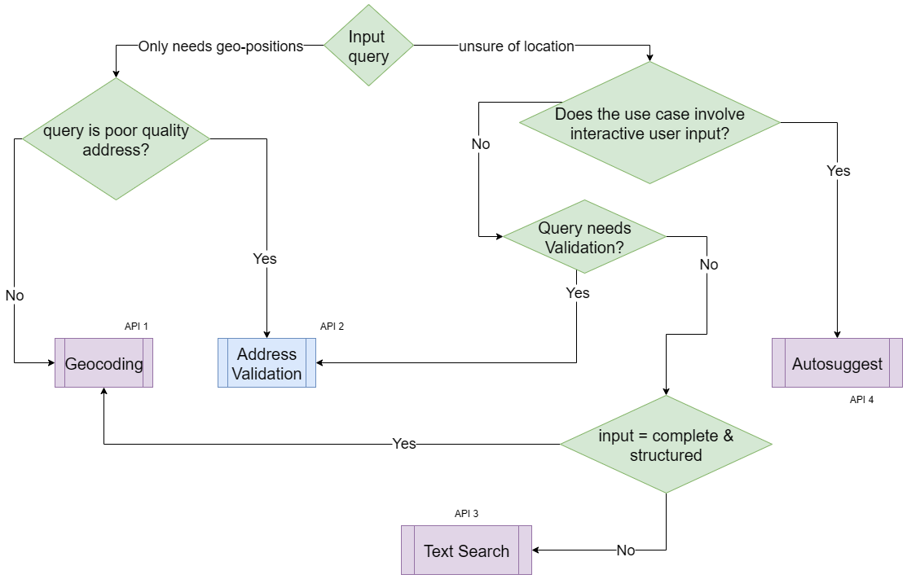

[ </p>](https://about.mappls.com/api/)
# Mappls Address Validation API 

**Easy To Integrate Maps & Location APIs & SDKs For Web & Mobile Applications**

Powered with India's most comprehensive and robust mapping functionalities.

You can get your api key to be used in this document here: [https://about.mappls.com/api/](https://about.mappls.com/api/)

## Introduction

MapmyIndia's Address Validation service enhances delivery accuracy and minimizes failures, leading to a better customer experience. It achieves this by identifying incorrect addresses and offering deeper insights into address attributes. 

If validating individual address components isn't required, the Geocoding API may be a more suitable choice. It transforms addresses into latitude and longitude coordinates. In contrast, the Address Validation service ensures the accuracy and real-world existence of an address.

### Where can you use Address Validation
The Address Validation service helps determine whether an address corresponds to a real-world location. If it does not, the service can highlight potentially incorrect components, allowing customers to make necessary corrections. Below is a sample workflow illustrating how the service functions:

1. **Customer enters an address** – A basic form enables the customer to input an address, often as part of a checkout process.
2. **App sends the address to the Address Validation service** – The application submits the provided address to the Address Validation service.
3. **Service validates and standardizes the address** – The service processes the input and either returns a standardized version of the address or identifies missing details.
4. **Customer confirms or corrects the address** – Based on the service's response, the customer can:
   - Accept the suggested address.
   - Add any missing details.
   - Correct any identified errors.

### How it works

The Address Validation service processes a GET request containing the address as a query payload. It breaks down the address into its individual components and performs the following actions:
- `Correction` – Validates address components at a granular level, including administrative hierarchies when available.
- `Completion` – Identifies and infers missing or incorrect address tokens.
- `Formatting` – Standardizes and optimizes the address structure for consistency.

### Address Validation vs Geocoding ( & other Search APIs)



### Build your validation logic

This section outlines a process for developing an address validation system capable of handling various responses from the Address Validation Service. It explains how to structure your logic to interpret the service response effectively, assess additional signals, and determine when to request further input from customers.

Generally, the service response guides how your system should process an address:
1. `Fix` – The address quality is low, requiring additional details from the user.
2. `Confirm` – The address is valid but differs from the input; user confirmation may be needed.
3. `Accept` – The address is accurate and can be used as provided.

#### Fix the address

The summary in the response highlights critical missing details that need to be provided. The address returned by the Address Validation service may not meet the standards for deliverability.

*When to do this*

Any of the following is true.
- The address is flagged as incomplete.
- Validation Level is lower than acceptable as per your use case.

*What to do* 
- Investigate address tokens if necessary.
- Prompt the customer to fix address issues.
- Request validation for the updated address.

#### Confirm the address

The summary in the response confirms that the address is deliverable but includes modifications to the original input, such as inferred details through spell correction or data that requires confirmation.

*When to do this*

All of the following are applicable.
- The address is flagged as complete.
- Validation Level is within acceptable range as per your use case.
- Address has inferred or replaced components.

*What to do* 
- Investigate address tokens if necessary.
- Request validation for the updated address.

#### Accept the address

The Address Validation service response indicates an excellent quality address.

*When to do this*

All of the following are applicable.
- The address is flagged as complete.
- Validation Level is at houseName, houseNumber or POI level.
- Address has NO inferred or replaced components.

*What to do*
 
Proceed with the returned address.


## Getting Access

Before using the API in the your solution, please ensure that the related access is enabled in the [Mappls Console](https://auth.mappls.com/console/), within your app - be it for Mobile OR Web or Cloud integration.

1. Copy and paste the key from your `credentials` section from your API [keys](https://auth.mappls.com/console/) into the `access_token` query parameter.
    - Your static key can be secured by whitelisting its usage for particular IPs (in case of cloud app usage) OR a set of domains (in case of a web app)
    - Your static key obtained from your Console is to be passed as a query parameter: `access_token`.

## Authentication Object - `access_token` mandatory query parameter.

-  `access_token`: "hklmgbwzrxncdyavtsuojqpiefrbhqplnm".


## Input Method
GET

## Input URL

```html
https://search.mappls.com/search/address/addressValidation?
```

## Request Parameters

### Mandatory Parameters

 - `address`(string): Address to be cleansed, parsed and standardized. e.g. 237 Okhla industrial estate phase 3 new Delhi, Delhi 110020

### Optional Parameters

Not Applicable

## Response Parameters

# Response Structure of Address Validation API

1. `inputAddress` *(string)*:  Raw address as provided in the request.
2. `validationData` *(object)*
   - `formattedAddress` *(string, optional)*  Standardized/normalized address generated by the service. Present only in responses where address is complete and there is no ambiguity(multiple probable tokens) in address tokens.
   - `remainingAddress` *(string)* Portion of the input address that could not be validated or mapped.
   - `validationSummary` *(object)*
     - `inputLevel` *(string)* – Highest level of detail detected in the input (e.g., *house*, *buildingName*, *landmark*, *village*).
     - `validationLevel` *(string)* – Highest level of the address successfully validated (e.g., *locality*, *village*, *city*, *subSubLocality*).
     - `geocodeLevel` *(string)* – Level at which geocoding was possible.
     - `isAddressComplete` *(boolean)* – Indicates whether the address is [considered complete](#when-is-an-address-considered-complete).
     - `containsUnconfirmedTokens` *(array of strings)* – List of address components that were detected but not confirmed.
     - `containsInferredTokens` *(array of strings)* – Components inferred by the system (e.g., *pincode*, *subDistrict*, *city*).
     - `containsReplacedTokens` *(array of strings)* – Components replaced during validation (e.g., replaced pincodes).
   - `validationObject` *(object)*  Contains detailed breakdown of identified address components. Each component is represented as an **array of objects**, since multiple tokens can exist.
     - `{component-name}` *(array of objects, optional)* Array of the component which can be any one of list [mentioned here](#list-of-applicable-components): 
       - `token` *(string)* – Extracted house number/name.
       - `tag` *(string)* – Validation status (either of the following values:
         - `UNCONFIRMED_PLAUSIBLE`
         - `CONFIRMED`
         - `UNCONFIRMED_FLAGGED`
       - `eLoc` *(string)* – MapmyIndia’s unique eLoc identifier. Only available in administrative address components.
       <br>Either of the following may also be present: 
       - `inferred` *(boolean, optional)* – Whether the component was inferred.
       - `replaced` *(boolean, optional)* – Indicates the component was replaced.
       - `corrected` *(boolean, optional)* – Indicates the component was corrected.
     


#### [When is an address considered complete](#when-is-an-address-considered-complete)

An address is considered complete when it: 
- Does not have more than 1 `inferred` + 1 `replaced` + 1 `corrected` address tokens.
- The structure has at-least one detectable point location attribute: either a poi or landmark or house number or house name.

#### [List of applicable components](#list-of-applicable-components)

Types of address components: 
1. `careOf`
2. `house`
3. `buildingName`
4. `poi`
5. `landmark`
6. `street`
7. `subSubLocality`
8. `subLocality`
9. `locality`
10. `village`
11. `city`
12. `subDistrict`
13. `district`
14. `state`
15. `countryName`
16. `pincode`
17. `postOffice`
18. `parsedPincode`

## Response Type

- JSON

<!-- ## Live Demo

You can also experience this address standardization API through our demo. For experience please [click here]() -->

## Response Codes {as HTTP response code}

### Success:

1. `200`: To denote a successful API call. 
2. `204`: To denote the API was a success but no results we’re found.

### Client-Side Issues:

1. `400`: Bad Request, User made an error while creating a valid request. 
2. `401`: Unauthorized, Developer’s key is not allowed to send a request with restricted parameters. 
3. `403`: Forbidden, Developer’s key has hit its daily/hourly limit

### Server-Side Issues:

1. `500`: Internal Server Error, the request caused an error in our systems. 
2. `503`: Service Unavailable, during our maintenance break or server downtime.

## Sample Input cURL

```js
curl --location 'https://search.mappls.com/search/address/addressValidation?address=Hannah%20Sen%20Cottage%2C%20Lady%20Irwin%20College%2C%20Sikandra%20Road%2C%20Mandi%20House%2C%20New%20Delhi%20110001&access_token=&access_token=hklmgbwzrxncdyavtsuojqpiefrbhqplnm'
```

## Sample Response

```json
{
    "inputAddress": "Hannah Sen Cottage, Lady Irwin College, Sikandra Road, Mandi House, New Delhi 110001",
    "validationData": {
        "remainingAddress": "",
        "validationSummary": {
            "inputLevel": "buildingName",
            "validationLevel": "locality",
            "geocodeLevel": "locality",
            "isAddressComplete": false,
            "containsUnconfirmedTokens": [
                "buildingName",
                "poi",
                "street"
            ],
            "containsInferredTokens": [],
            "containsReplacedTokens": []
        },
        "validationObject": {
            "buildingName": [
                {
                    "token": "mandi house",
                    "tag": "UNCONFIRMED_PLAUSIBLE"
                }
            ],
            "poi": [
                {
                    "token": "hannah sen cottage",
                    "tag": "UNCONFIRMED_PLAUSIBLE"
                }
            ],
            "street": [
                {
                    "token": "sikandra road",
                    "tag": "UNCONFIRMED_PLAUSIBLE"
                }
            ],
            "locality": [
                {
                    "token": "Lady Irwin College Campus",
                    "eLoc": "BGKAFR",
                    "tag": "CONFIRMED"
                }
            ],
            "city": [
                {
                    "token": "New Delhi",
                    "eLoc": "TAVI5S",
                    "tag": "CONFIRMED"
                }
            ],
            "state": [
                {
                    "token": "Delhi",
                    "eLoc": "518NSV",
                    "tag": "CONFIRMED"
                }
            ],
            "pincode": [
                {
                    "token": "110001",
                    "eLoc": "110001",
                    "tag": "CONFIRMED"
                }
            ],
            "parsedPincode": [
                {
                    "token": "110001",
                    "tag": "UNCONFIRMED_PLAUSIBLE"
                }
            ]
        }
    }
}
```

<br>

For any queries and support, please contact: 

[ </p>](https://about.mappls.com/api/)
Email us at [apisupport@mappls.com](mailto:apisupport@mappls.com)


[Support](https://about.mappls.com/contact/)
Need support? contact us!

<br></br>
<br></br>

[<p align="center">  ](https://stackoverflow.com/questions/tagged/mappls-api)[](https://about.mappls.com/blog/)[](https://github.com/Mappls-api)[ </p>](https://www.npmjs.com/org/mapmyindia) 


[<p align="center">  ](https://www.facebook.com/Mapplsofficial)[](https://twitter.com/mappls)[](https://www.linkedin.com/company/mappls/)[](https://www.youtube.com/channel/UCAWvWsh-dZLLeUU7_J9HiOA)


<div align="center">@ Copyright 2025 CE Info Systems Ltd. All Rights Reserved.</div>

<div align="center"> <a href="https://about.mappls.com/api/terms-&-conditions">Terms & Conditions</a> | <a href="https://about.mappls.com/about/privacy-policy">Privacy Policy</a> | <a href="https://about.mappls.com/pdf/mapmyIndia-sustainability-policy-healt-labour-rules-supplir-sustainability.pdf">Supplier Sustainability Policy</a> | <a href="https://about.mappls.com/pdf/Health-Safety-Management.pdf">Health & Safety Policy</a> | <a href="https://about.mappls.com/pdf/Environment-Sustainability-Policy-CSR-Report.pdf">Environmental Policy & CSR Report</a>

<div align="center">Customer Care: +91-9999333223</div>

[def]: ./